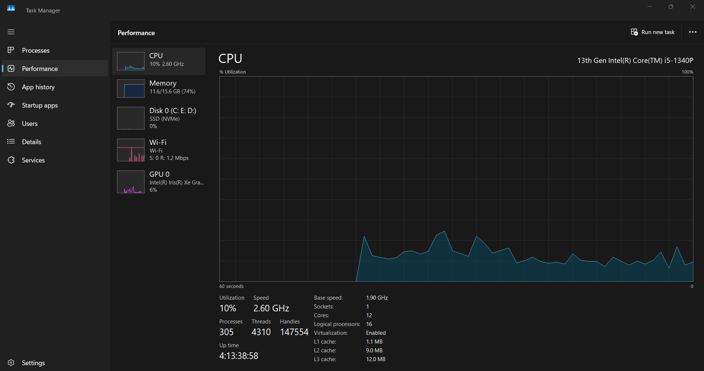

# Installing Docker Desktop on Windows

> **Follow steps in order.** Each step builds on the previous one.

---

## Requirements

Before you begin, make sure your system meets these prerequisites:

- Windows 10 or Windows 11
- Virtualization enabled in BIOS/UEFI
- WSL 2 support (build 19041 or later - run `winver` to check)
- At least 4 GB RAM (8 GB recommended)

---

## Step 1 - Enable virtualization in BIOS

> ⚠️ **Do this before anything else.** Skip if you've already enabled it.

Restart your PC and enter BIOS/UEFI by pressing **Del**, **F2**, or **F10** during startup (the key varies by manufacturer). Find the CPU virtualization setting - it may be labelled **Intel VT-x**, **AMD-V**, or **SVM Mode** - and enable it. Save and exit.

**Not sure if it's already on?** Open Task Manager -> Performance -> CPU. Look for **Virtualization: Enabled**.



---

## Step 2 - Enable WSL 2

Open **PowerShell as Administrator** (right-click the Start menu -> Windows Terminal (Admin) or PowerShell (Admin)) and run:

```powershell
wsl --install
```

> ⚠️ Your PC will likely prompt you to **restart**. Do so before continuing to Step 3.

**On older Windows 10 builds:** If you're on a build earlier than 19041, you may need to enable WSL manually via Windows Features. Run `winver` to check your build number.

---

## Step 3 - Install Docker Desktop

1. Go to [docker.com/products/docker-desktop](https://www.docker.com/products/docker-desktop/) and download the Windows installer.
2. Run **Docker Desktop Installer.exe**.
3. On the configuration screen, make sure **"Use WSL 2 instead of Hyper-V"** is checked. Leave other defaults as-is.
4. Click **OK** and wait for the installation to complete. Restart if prompted.

> ℹ️ The installer may ask about starting Docker on login - you can choose either way and change it later in Settings.

---

## Step 4 - What's included: Docker Desktop overview

Docker Desktop is a complete local container environment. Here's what comes with it:

| Component | Description |
|---|---|
| **Docker Engine** | Core container runtime |
| **Docker CLI** | Command-line interface (`docker` commands) |
| **Docker Compose** | Run and manage multi-container apps |
| **GUI Dashboard** | Manage containers, images, and volumes visually |

The dashboard lets you start, stop, inspect, and delete containers without the command line if you prefer.


---

## Step 5 - Recommended first settings

Open Docker Desktop and click the ⚙️ **gear icon** (top-right) to open Settings.

- **General:** Enable *"Start Docker Desktop when you log in"* so Docker is always ready when you need it.
- **Resources -> WSL Integration:** Enable integration for your Linux distro (e.g. Ubuntu). This lets you run `docker` commands from inside WSL as well.
- **General:** Keep *"Check for updates automatically"* on - Docker releases frequent security patches.

---

## Step 6 - Verify installation

Open a new terminal (PowerShell or Command Prompt) and run these three commands one at a time:

```powershell
docker --version
```
Expected output: `Docker version 27.x.x, build ...`

```powershell
docker compose version
```
Expected output: `Docker Compose version v2.x.x`

```powershell
docker run hello-world
```
Expected output: A message that begins with **"Hello from Docker!"**

### What a successful result looks like

| Command | Expected result |
|---|---|
| `docker --version` | Prints version number |
| `docker compose version` | Prints Compose version |
| `docker run hello-world` | Prints "Hello from Docker!" |

> ✅ If all three pass, Docker is fully installed and working. You're ready to build.

> ⚠️ **Getting a "cannot connect to Docker daemon" error?** Make sure Docker Desktop is actually running - check your system tray for the Docker whale icon.

---

## Troubleshooting quick reference

| Symptom | Fix |
|---|---|
| `wsl --install` fails | Make sure you're running PowerShell as Administrator |
| Docker Desktop won't start | Confirm virtualization is enabled in BIOS (Step 1) |
| "Cannot connect to daemon" error | Docker Desktop isn't running - launch it from the Start menu |
| WSL integration not working | Go to Settings -> Resources -> WSL Integration and enable your distro |
| Installer asks about Hyper-V | Choose WSL 2 - it's faster and the recommended option |
