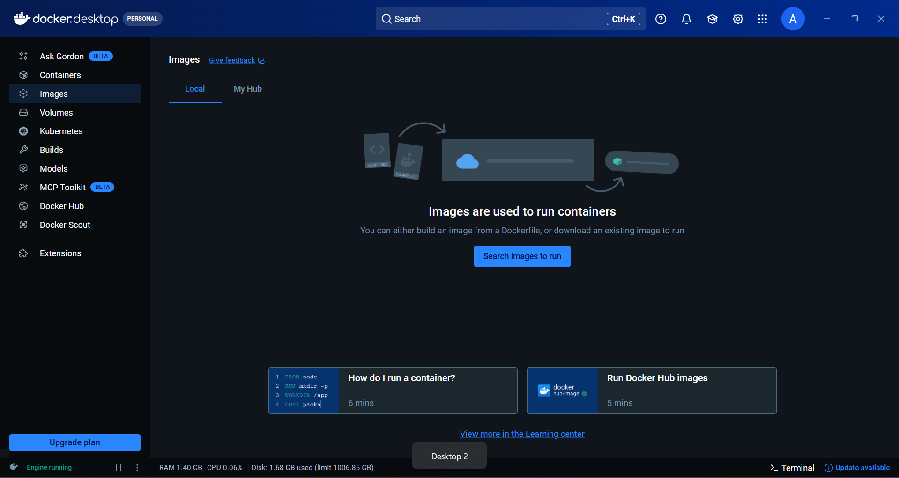

# Installation Setup (Windows + Docker Desktop)

This module combines installation steps and Docker Desktop overview in one place.

## Requirements

- Windows 10/11 with virtualization enabled
- WSL 2 support enabled
- At least 4 GB RAM (8 GB recommended)

## 1. Enable Virtualization

Enable virtualization from BIOS/UEFI settings before installing Docker.


## 2. Enable WSL

Open PowerShell as Administrator and run:

```powershell
wsl --install
```

Restart your machine if prompted.

## 3. Install Docker Desktop

1. Download Docker Desktop from the official Docker website.
2. Run the installer.
3. Keep the option "Use WSL 2 instead of Hyper-V" enabled.
4. Complete setup and restart if required.

## 4. Docker Desktop Overview

Docker Desktop includes:

- Docker Engine
- Docker CLI
- Docker Compose
- GUI dashboard for containers, images, and volumes



## 5. Recommended First Settings

- Turn on "Start Docker Desktop when you log in"
- Enable WSL integration for your distro
- Keep Docker Desktop updated

## 6. Verify Installation

Run:

```bash
docker --version
docker compose version
docker run hello-world
```

If these commands run successfully, your Docker setup is ready.
