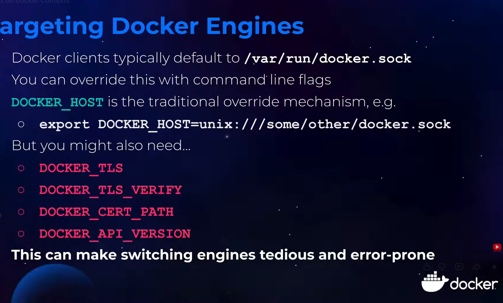
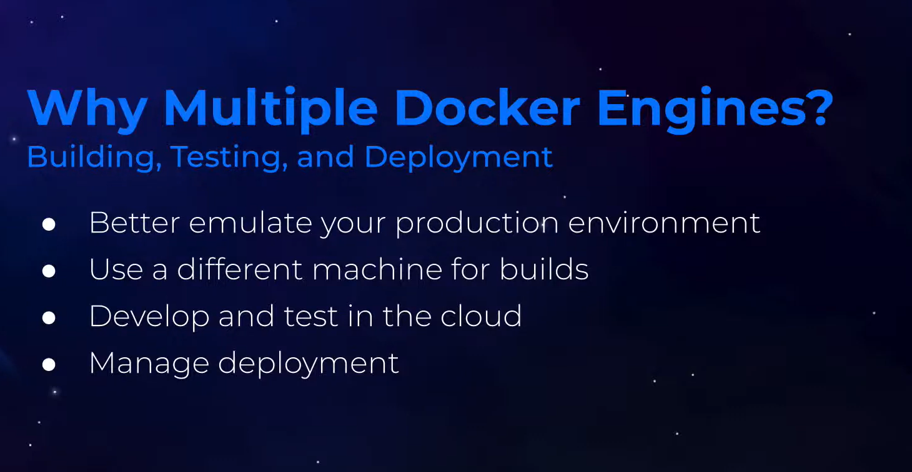
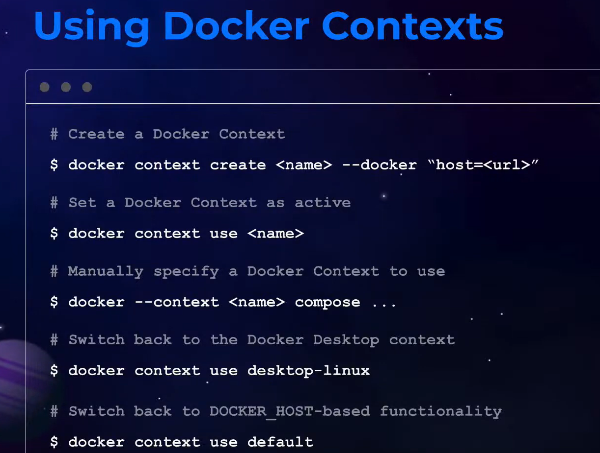

# Docker Context Basics: Multi-Environment Management

## 📌 What is Docker Context?

**Docker Context** is a powerful feature that allows you to switch between different Docker endpoints seamlessly. Instead of manually changing environment variables or connection strings, contexts enable you to define and switch between multiple Docker environments with a single command.

### Why Docker Context Matters

✅ **Multi-Environment Management** - Easily switch between local and remote Docker engines  
✅ **Safe Workflows** - Prevent accidental deployments to wrong environments  
✅ **SSH Support** - Connect to remote Docker engines securely  
✅ **Zero Configuration** - No need to change DOCKER_HOST environment variables  
✅ **Team Collaboration** - Share context configurations across teams  

---

## 🎯 Context Architecture Overview



A Docker context consists of:

1. **Endpoint Configuration** - Connection details to Docker engine
2. **Metadata** - Description and additional information
3. **TLS Settings** - Security certificates and keys (for remote connections)
4. **Default Context** - The currently active context

---

## 📋 Common Context Types



| Type | Connection | Use Case |
|------|-----------|----------|
| **Local** | UNIX socket or Windows pipe | Development machine |
| **SSH** | Secure Shell connection | Remote Linux servers |
| **TCP** | Raw TCP connection | Remote Docker API |
| **Cloud** | Cloud provider endpoints | AWS, Azure, GCP |

---

## 🚀 Working with Docker Contexts

### View Current and Available Contexts

```bash
# List all contexts
docker context ls

# Show the active context
docker context show

# Inspect detailed context information
docker context inspect default
```

### Sample Output

```
NAME                DESCRIPTION                             DOCKER ENDPOINT             KUBERNETES ENDPOINT
default             Current DOCKER_HOST based config         unix:///var/run/docker.sock  
my-local            Local Docker Desktop                     unix:///var/run/docker.sock
prod-server         Production remote server                 ssh://user@prod.example.com
staging             Staging environment                      ssh://user@staging.example.com
```

---

## 🔄 Switch Between Contexts

```bash
# Switch to a different context
docker context use prod-server

# Verify you switched correctly
docker context show

# Run commands on the new context
docker ps
docker service ls
```

⚠️ **Pro Tip**: Always run `docker context show` before executing critical commands!

---

## 🌐 Remote Context Management



### Create an SSH Context

```bash
# Create context for remote server
docker context create prod \
  --description "Production server" \
  --docker "host=ssh://user@192.168.1.10"

# Create context with custom SSH port
docker context create dev \
  --docker "host=ssh://user@dev-server.example.com:2222"

# Create context with key-based authentication
docker context create secure \
  --docker "host=ssh://user@remote.host" \
  --docker-cert-path ~/.docker/certs
```

### Verify Remote Connection

```bash
# Test the remote context
docker context use prod
docker version
docker info
```

---

## 🔍 Inspecting Contexts

### Get Detailed Context Information

```bash
# Inspect current context
docker context inspect

# Inspect specific context
docker context inspect prod-server

# Pretty-print context details
docker context inspect --pretty prod-server
```

### Example Output

```json
{
  "Name": "prod-server",
  "Metadata": {
    "Description": "Production environment"
  },
  "Endpoints": {
    "docker": {
      "Host": "ssh://user@prod.example.com",
      "SkipTLSVerify": false
    }
  }
}
```

---

## 🗑️ Managing Contexts

### Remove a Context

```bash
# Delete a context
docker context rm prod-server

# Remove multiple contexts
docker context rm dev staging
```

⚠️ **Important**: You cannot remove the context currently in use. Switch to another context first!

```bash
# This will fail if 'prod' is active
docker context rm prod

# Solution: Switch first
docker context use default
docker context rm prod
```

### Update a Context

```bash
# Update context description
docker context update --description "New description" prod

# Update endpoint
docker context update --docker host=ssh://newuser@newhost prod
```

---

## 💡 Practical Use Cases

### Development Workflow

```bash
# Create local development context
docker context create local-dev --docker host=unix:///var/run/docker.sock

# Create staging context
docker context create staging --docker host=ssh://dev@staging.internal

# Create production context
docker context create production --docker host=ssh://devops@prod.internal

# Switch when needed
docker context use staging
docker pull myapp:latest
docker run -d myapp:latest
```

### Team Collaboration

```bash
# Export context for team
docker context export prod-server

# Import shared context
docker context import prod-server ./prod-context.docker

# Verify imported context
docker context ls
docker context use prod-server
```

---

## 🛡️ Security Best Practices

### ✅ Do's

- ✅ Use SSH connections for remote access
- ✅ Use key-based authentication instead of passwords
- ✅ Store contexts in secure locations
- ✅ Verify context before running critical commands
- ✅ Use descriptive context names
- ✅ Regularly audit context configurations

### ❌ Don'ts

- ❌ Expose DOCKER_HOST to untrusted networks
- ❌ Use unencrypted TCP connections
- ❌ Store credentials in context metadata
- ❌ Mix production and development contexts
- ❌ Share production context credentials

---

## 🔐 Advanced: TLS-Protected Context

```bash
# Create context with TLS certificates
docker context create secure-prod \
  --description "TLS-protected production" \
  --docker "host=tcp://prod-docker.company.com:2376" \
  --docker-cert-path ~/.docker/prod-certs \
  --docker-ca-path ~/.docker/prod-certs/ca.pem

# Verify TLS connection
docker context use secure-prod
docker version
```

---

## ⚠️ Safe Workflow Checklist

```bash
# 1. Verify active context
docker context show

# 2. Confirm connection is working
docker version

# 3. List available resources
docker ps
docker images

# 4. Execute your command
docker deploy myservice

# 5. Verify results
docker service ls
```

---

## 📊 Common Commands Reference

| Command | Purpose |
|---------|---------|
| `docker context ls` | List all contexts |
| `docker context show` | Show current context |
| `docker context use <name>` | Switch context |
| `docker context create <name>` | Create new context |
| `docker context inspect <name>` | View details |
| `docker context update <name>` | Modify context |
| `docker context rm <name>` | Delete context |
| `docker context export <name>` | Export context |
| `docker context import <name>` | Import context |

---

## 🎯 Quick Start Guide

1. **List available contexts**
   ```bash
   docker context ls
   ```

2. **Create a remote context**
   ```bash
   docker context create prod --docker "host=ssh://user@192.168.1.10"
   ```

3. **Verify connection**
   ```bash
   docker context use prod
   docker version
   ```

4. **Run commands on remote**
   ```bash
   docker ps
   docker pull nginx:latest
   ```

5. **Switch back to local**
   ```bash
   docker context use default
   ```

---

## 🔗 Comparison: Docker Context vs Alternatives

| Method | Ease | Flexibility | Safety |
|--------|------|------------|--------|
| **Docker Context** | ⭐⭐⭐ | ⭐⭐⭐ | ⭐⭐⭐ |
| DOCKER_HOST env | ⭐ | ⭐⭐ | ⭐ |
| SSH tunneling | ⭐⭐ | ⭐⭐ | ⭐⭐⭐ |
| Docker Machine | ⭐⭐ | ⭐⭐ | ⭐⭐ |

---

## Conclusion

Docker Context provides a clean, intuitive way to manage multiple Docker environments. Whether you're working with local development, staging, or production servers, contexts keep your workflow organized and safe. Master context switching to streamline your multi-environment Docker workflows.

**Next Steps**: Create contexts for your environments, practice switching between them, and implement context-based workflows in your team.
