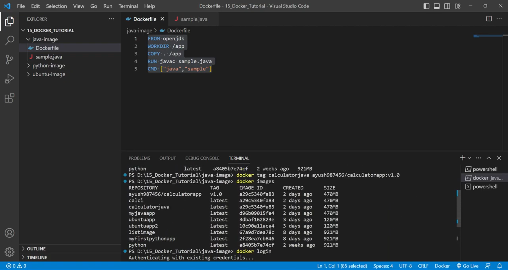
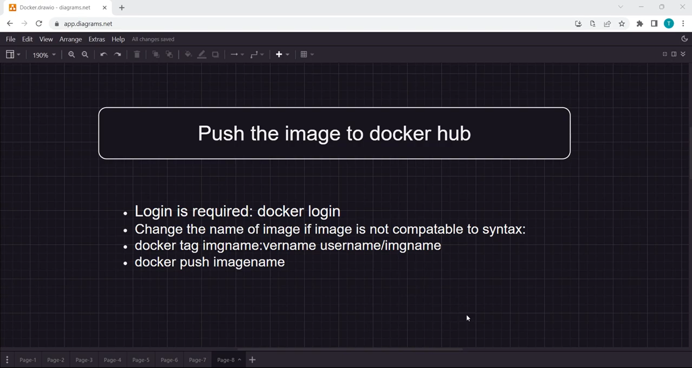

# Docker Hub: Public and Private Registries

## Overview

Docker Hub is a cloud-based repository service provided by Docker for finding and sharing container images. It is the world's largest library and community for container images, serving as the central hub for the Docker ecosystem.

---

## What is Docker Hub?

Docker Hub is the default registry for Docker, allowing developers to:

- **Store and share** container images
- **Access official images** from verified publishers
- **Automate builds** from GitHub or Bitbucket
- **Manage private repositories** for internal projects
- **Scan images** for vulnerabilities

### Core Features



**Public Repositories**: Openly accessible images for the community.
**Private Repositories**: Securely stored images for restricted access.
**Official Images**: High-quality, curated images maintained by Docker and partners.
**Automated Builds**: Sync with source control to trigger image builds on commit.

---

## Repositories and Tagging

### Understanding Image Management



In Docker Hub, images are organized into repositories, and each repository can contain multiple versions identified by tags:

1. **Namespace**: Usually your username or organization name.
2. **Repository Name**: The name of the application or service (e.g., `nginx`).
3. **Tags**: Represent versions (e.g., `latest`, `v1.0`, `alpine`).

---

## Typical Workflow: Pushing and Pulling

### 1. Authenticating with the Registry

Before you can push images, you must authenticate your local Docker client:

```bash
# Log in to your Docker Hub account
docker login
```

### 2. Tagging and Pushing Images

To push an image to Docker Hub, it must be tagged with your namespace:

```bash
# Tag an existing image
docker tag my-app:latest <YOUR_USERNAME>/my-app:v1.0

# Push the image to the registry
docker push <YOUR_USERNAME>/my-app:v1.0
```

### 3. Pulling and Running Images

Pulling images is the most common operation, often done automatically by orchestration tools:

```bash
# Pull an image from Docker Hub
docker pull <YOUR_USERNAME>/my-app:v1.0

# Run the pulled image
docker run -d -p 8080:80 <YOUR_USERNAME>/my-app:v1.0
```

---

## Best Practices for Docker Hub

✅ **Do**
- Use specific tags instead of `latest` in production
- Scan your images for vulnerabilities regularly
- Use multi-stage builds to keep images small
- Add a README to your repositories for better documentation
- Use official images as base images whenever possible

❌ **Don't**
- Store secrets or credentials in your images
- Use large, unoptimized base images
- Leave unused repositories in your account
- Use `latest` tag in CI/CD pipelines
- Forget to set up automated builds for critical projects

---

## Comparison: Public vs Private Registries

| Feature | Public Repository | Private Repository |
|---------|-------------------|--------------------|
| **Visibility** | Everyone | Only authorized users |
| **Cost** | Free | Paid (usually 1 free) |
| **Use Case** | Open Source / Demo | Proprietary / Production |
| **Security** | Public Audit | Role-Based Access (RBAC) |

---

## Getting Started Checklist

- [ ] Create a Docker Hub account
- [ ] Log in locally via CLI
- [ ] Build and tag your first image
- [ ] Push image to a public repository
- [ ] Verify image on Hub dashboard
- [ ] Configure a private repository
- [ ] Set up an automated build (optional)

---

## Conclusion

Docker Hub is an essential tool for any Docker-based workflow, providing the infrastructure needed to distribute and manage container images globally. By following best practices for tagging and security, you can ensure your applications are always available and secure.

**Next Steps**: Explore [GHCR (GitHub Container Registry)](ghcr-guide.md) for alternative hosting options or set up a local private registry for testing.
