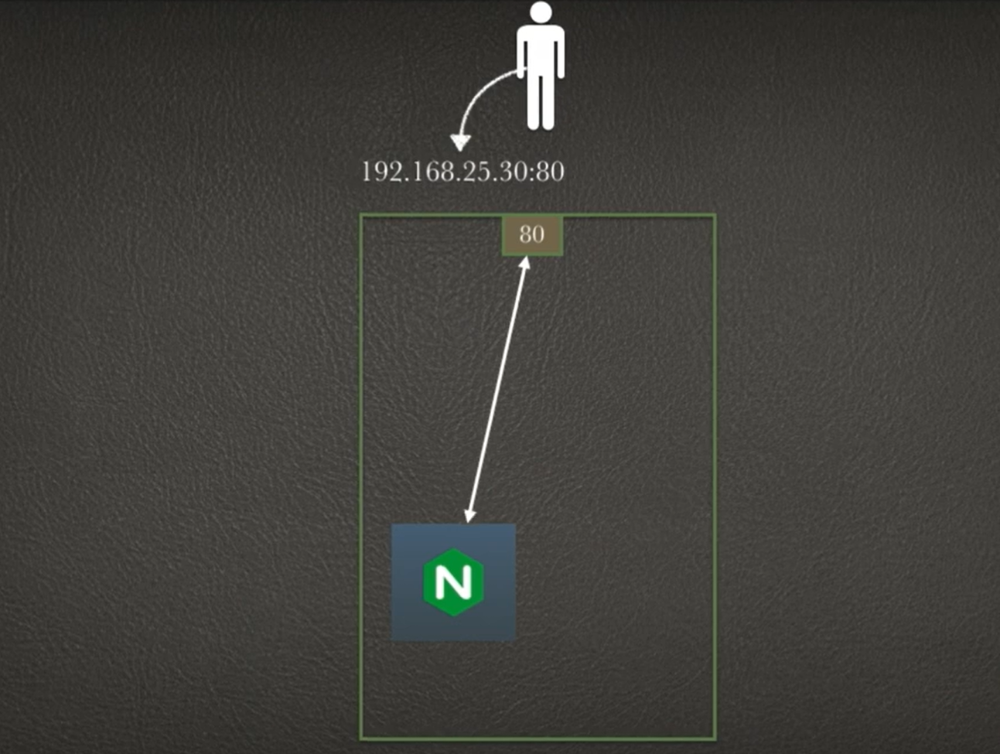
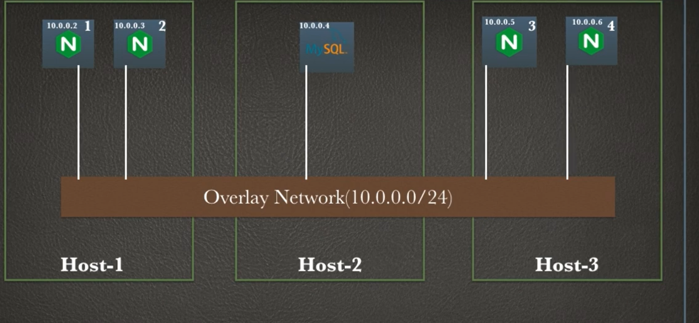
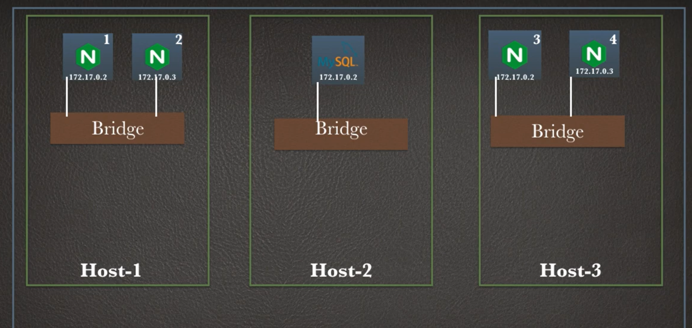

# Docker Swarm: Orchestration and Clustering

## Overview

Docker Swarm is Docker's native clustering and orchestration solution. It enables you to create and manage a swarm of Docker nodes as a single virtual system. Swarm mode turns a group of Docker engines into a single, managed cluster for running distributed applications at scale.

---

## What is Docker Swarm?

Docker Swarm is a container orchestration platform that allows you to:

- **Deploy applications** across multiple machines
- **Manage services** at scale
- **Load balance** traffic across containers
- **Handle failover** and ensure high availability
- **Perform rolling updates** with zero downtime

### Key Components



**Manager Nodes**: Control the swarm state and manage tasks distribution
**Worker Nodes**: Execute tasks and maintain service replicas
**Services**: Define applications running on the swarm
**Tasks**: The actual container instances running services

---

## Architecture and Structure

### Nodes in a Swarm



A Docker Swarm consists of:

1. **Manager Nodes**
   - Maintain cluster state
   - Schedule services
   - Serve the swarm API
   - Consensus-based management using Raft

2. **Worker Nodes**
   - Execute container tasks
   - Report status to managers
   - No management responsibilities

---

## Services and Deployment

### Understanding Services



A service is an abstraction that represents a replicated task running on the swarm:

```bash
# Create a service
docker service create --name web --replicas 3 -p 80:80 nginx

# List services
docker service ls

# Inspect service
docker service inspect web

# Scale a service
docker service scale web=5

# Update a service
docker service update --image nginx:latest web
```

---

## Advanced Features

### Load Balancing and Networking


Docker Swarm provides:

- **Ingress Load Balancing**: Distributes external traffic to service replicas
- **Overlay Networks**: Enable secure communication between services
- **Service Discovery**: Built-in DNS for service-to-service communication
- **VIP (Virtual IP)**: Stable endpoint for services regardless of container changes

---

## Complete Example: Multi-Service Application

### Initialize a Swarm

```bash
# On the manager node
docker swarm init

# Add worker nodes
docker swarm join --token SWMTKN-... 192.168.1.100:2377
```

### Deploy a Multi-Tier Stack

```bash
# Create overlay network
docker network create --driver overlay myapp-network

# Deploy database service
docker service create \
  --name db \
  --network myapp-network \
  --replicas 1 \
  -e MYSQL_ROOT_PASSWORD=password \
  mysql:5.7

# Deploy web service
docker service create \
  --name web \
  --network myapp-network \
  --replicas 3 \
  -p 80:80 \
  mywebapp:latest

# Deploy cache service
docker service create \
  --name cache \
  --network myapp-network \
  --replicas 2 \
  redis:latest
```

---

## Monitoring and Management

### Key Management Commands

```bash
# View swarm information
docker info

# List nodes
docker node ls

# List services
docker service ls

# View service tasks
docker service ps web

# View logs
docker service logs web

# Remove a service
docker service rm web
```

### Maintenance

```bash
# Drain a node (move tasks away)
docker node update --availability drain worker-node-1

# Promote a worker to manager
docker node promote worker-node-1

# Demote a manager to worker
docker node demote manager-node-1

# Leave the swarm
docker swarm leave
```

---

## Best Practices

✅ **Do**
- Use an odd number of manager nodes (3, 5, 7) for consensus
- Separate manager and worker nodes in production
- Use overlay networks for service communication
- Implement health checks in services
- Use resources constraints (CPU, memory)
- Maintain backup copies of swarm state

❌ **Don't**
- Run with a single manager node in production
- Mix services on manager nodes unnecessarily
- Expose managers to external networks
- Use host mode networking for load-balanced services
- Ignore backup and disaster recovery

---

## Comparison: Docker Swarm vs Kubernetes

| Feature | Docker Swarm | Kubernetes |
|---------|--------------|-----------|
| **Complexity** | Simple | Complex |
| **Learning Curve** | Easy | Steep |
| **Native Integration** | Built-in to Docker | Separate tool |
| **Scalability** | Good | Excellent |
| **Production Ready** | Yes | Yes |
| **Community** | Small | Large |
| **Use Case** | Small to medium | Enterprise |

---

## Getting Started Checklist

- [ ] Initialize Docker Swarm on manager node
- [ ] Add worker nodes to the swarm
- [ ] Create overlay networks
- [ ] Deploy services
- [ ] Configure load balancing
- [ ] Set up monitoring
- [ ] Implement backup strategy
- [ ] Test failover scenarios

---

## Conclusion

Docker Swarm provides a lightweight, integrated solution for container orchestration. While Kubernetes offers more features, Swarm excels in simplicity and ease of use, making it ideal for smaller deployments or teams new to orchestration. Choose Swarm when you need a straightforward solution without operational complexity.

**Next Steps**: Explore advanced networking, implement health checks, and practice rolling updates to master Docker Swarm orchestration.
