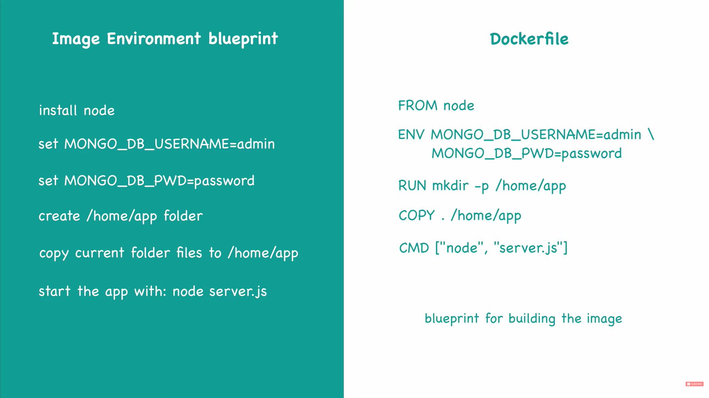
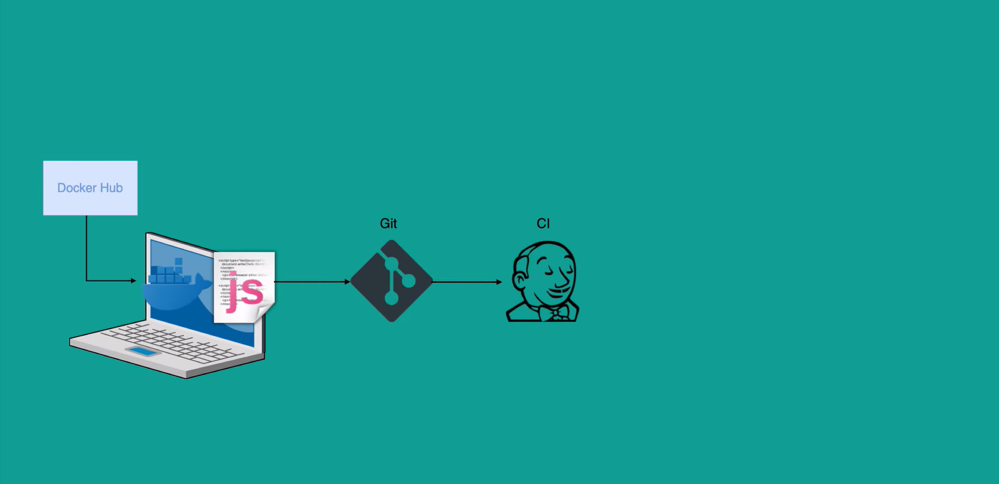
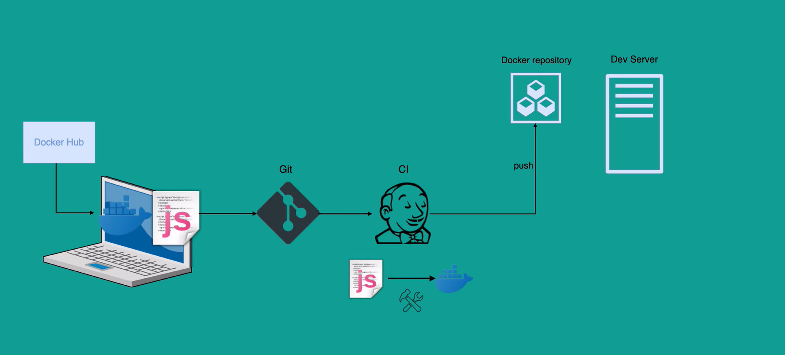
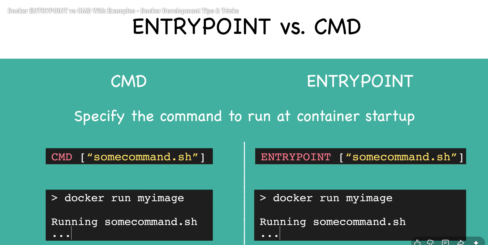

# Dockerfile Basics: Complete Guide to Container Images

## 📦 What is a Dockerfile?

A **Dockerfile** is a text file containing a set of instructions to build a Docker image. It's essentially a blueprint that automates the process of creating container images, enabling reproducible, consistent deployments across any environment.

### Why Dockerfiles Matter

✅ **Consistency** - Same build process every time  
✅ **Automation** - No manual steps or configuration  
✅ **Portability** - Works identically on any system  
✅ **Version Control** - Track changes to your application  
✅ **Documentation** - Infrastructure as code  

---

## 🏗️ Dockerfile Architecture and Build Process



The build process follows a layered approach where each instruction creates a new layer in the image. Understanding this architecture is crucial for optimizing build performance.

---

## 📋 Essential Dockerfile Instructions

### Base Image and Working Directory



```dockerfile
# Start with a base image
FROM ubuntu:22.04

# Set working directory
WORKDIR /app

# Set metadata
LABEL version="1.0" description="My application"
```

| Instruction | Purpose | Example |
|------------|---------|---------|
| `FROM` | Base image for building | `FROM node:18-alpine` |
| `WORKDIR` | Set container working directory | `WORKDIR /app` |
| `LABEL` | Add metadata to image | `LABEL maintainer="user@example.com"` |

---

## 🔧 Build and Runtime Instructions



### Copy and Run Commands

```dockerfile
# Copy files into the image
COPY package.json .
COPY src/ ./src/

# Install dependencies during build
RUN npm install

# Set environment variables
ENV NODE_ENV=production
ENV API_KEY=default_key

# Expose port documentation
EXPOSE 3000 8080

# Set metadata about what port to expose
EXPOSE 3000
```

| Instruction | Purpose | Example |
|------------|---------|---------|
| `COPY` | Copy files from host to container | `COPY . /app` |
| `ADD` | Copy with URL and auto-extract support | `ADD https://example.com/file.tar.gz /app` |
| `RUN` | Execute commands during build | `RUN npm install` |
| `ENV` | Set environment variables | `ENV PORT=3000` |
| `EXPOSE` | Document listening ports | `EXPOSE 8080` |

---

## ⚙️ Container Startup Configuration



### CMD vs ENTRYPOINT

```dockerfile
# Using CMD (can be overridden)
CMD ["npm", "start"]

# Using ENTRYPOINT (fixed entry point)
ENTRYPOINT ["node"]
CMD ["app.js"]

# Shell form
CMD npm start
```

| Instruction | Behavior | When to Use |
|------------|----------|-----------|
| `CMD` | Default command (can be overridden) | When command might change |
| `ENTRYPOINT` | Fixed entry point | When command should always run |

---

## 📝 Complete Real-World Examples

### Node.js Application

```dockerfile
FROM node:18-alpine

WORKDIR /app

LABEL maintainer="dev@example.com"

# Copy package files
COPY package*.json ./

# Install dependencies
RUN npm ci --only=production

# Copy application source
COPY src/ ./src/

# Expose port
EXPOSE 3000

# Health check
HEALTHCHECK --interval=30s --timeout=3s --start-period=5s --retries=3 \
  CMD node healthcheck.js

# Start application
CMD ["node", "src/index.js"]
```

### Python Application

```dockerfile
FROM python:3.11-slim

WORKDIR /app

COPY requirements.txt .

RUN pip install --no-cache-dir -r requirements.txt

COPY . .

ENV FLASK_APP=app.py

EXPOSE 5000

USER appuser

CMD ["python", "-m", "flask", "run", "--host=0.0.0.0"]
```

---

## 🚀 Building and Running Images

### Build Process

```bash
# Basic build
docker build -t my-app:1.0 .

# Build with build arguments
docker build --build-arg NODE_ENV=production -t my-app:1.0 .

# Build with multiple tags
docker build -t my-app:1.0 -t my-app:latest .

# View build history
docker history my-app:1.0
```

### Running Containers

```bash
# Run with port mapping
docker run -p 3000:3000 my-app:1.0

# Run with environment variables
docker run -e NODE_ENV=production my-app:1.0

# Run in background
docker run -d --name my-container my-app:1.0

# Run with volume mount
docker run -v /host/path:/container/path my-app:1.0

# Run with resource limits
docker run --memory="512m" --cpus="0.5" my-app:1.0
```

---

## ⚡ Performance Optimization

### Layer Caching Strategy

```dockerfile
# ❌ Bad: Dependencies rebuild on any source change
FROM node:18-alpine
WORKDIR /app
COPY . .
RUN npm install

# ✅ Good: Dependencies cached, only source code updated
FROM node:18-alpine
WORKDIR /app
COPY package*.json ./
RUN npm install
COPY . .
```

### Multi-Stage Build (Reduce Image Size)

```dockerfile
# Build stage
FROM node:18-alpine AS builder
WORKDIR /app
COPY package*.json ./
RUN npm ci --only=production

# Production stage
FROM node:18-alpine
WORKDIR /app
COPY --from=builder /app/node_modules ./node_modules
COPY src/ ./src/
CMD ["node", "src/index.js"]
```

---

## 🛡️ Best Practices

### ✅ Do's

- ✅ Use specific base image tags (not `latest`)
- ✅ Minimize layers and image size
- ✅ Copy dependency files before source code
- ✅ Use multi-stage builds for production
- ✅ Run containers as non-root user
- ✅ Use `.dockerignore` file
- ✅ Include health checks
- ✅ Add meaningful labels and metadata

### ❌ Don'ts

- ❌ Use `latest` tag in production
- ❌ Run as root user
- ❌ Combine multiple commands without `&&`
- ❌ Install unnecessary packages
- ❌ Forget to expose documentation (EXPOSE)
- ❌ Use large base images when smaller ones work
- ❌ Ignore .dockerignore file
- ❌ Skip security considerations

---

## 📚 Useful Files

### .dockerignore

Similar to `.gitignore`, reduces build context:

```
node_modules
npm-debug.log
.git
.env
.env.local
```

### Health Checks

```dockerfile
HEALTHCHECK --interval=30s --timeout=3s --start-period=5s --retries=3 \
  CMD curl -f http://localhost:3000/health || exit 1
```

---

## 🔍 Debugging and Inspection

```bash
# Inspect image
docker inspect my-app:1.0

# View build history/layers
docker history my-app:1.0

# View image size
docker images my-app:1.0

# Run container in interactive mode
docker run -it my-app:1.0 /bin/bash

# View container logs
docker logs <container-id>

# Check running processes in container
docker top <container-id>
```

---

## 📊 Quick Reference Table

| Task | Command |
|------|---------|
| Build image | `docker build -t app:1.0 .` |
| Run container | `docker run -d -p 3000:3000 app:1.0` |
| List images | `docker images` |
| Remove image | `docker rmi app:1.0` |
| View layers | `docker history app:1.0` |
| Inspect image | `docker inspect app:1.0` |

---

## 🎯 Getting Started Checklist

- [ ] Create Dockerfile with appropriate base image
- [ ] Define WORKDIR
- [ ] Copy dependency files
- [ ] Install dependencies with RUN
- [ ] Copy application source
- [ ] Expose required ports
- [ ] Define CMD or ENTRYPOINT
- [ ] Add HEALTHCHECK
- [ ] Create .dockerignore
- [ ] Test build and run
- [ ] Optimize for production
- [ ] Add labels and documentation

---

## Conclusion

Dockerfiles are the foundation of containerized applications. By mastering the essential instructions, understanding layer caching, and following best practices, you can create efficient, secure, and reproducible container images. Start with simple examples and gradually incorporate advanced techniques like multi-stage builds and health checks.

**Next Steps**: Practice building images, experiment with multi-stage builds, and explore image optimization techniques to become proficient with Dockerfiles.
