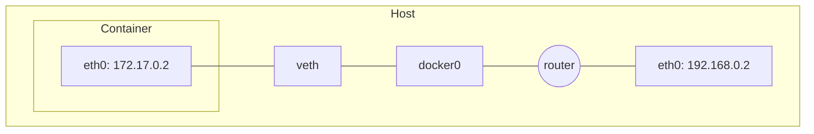
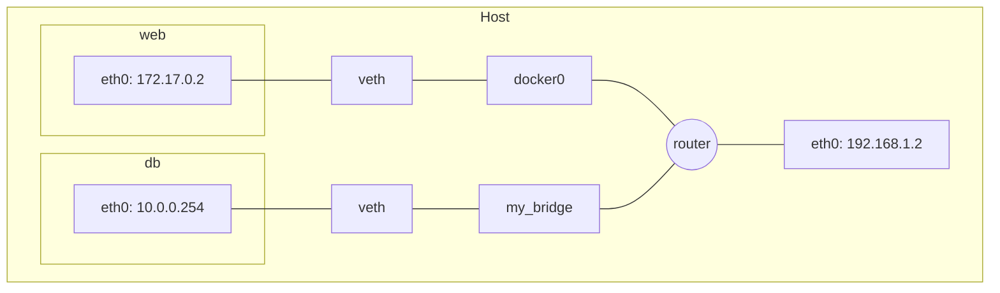
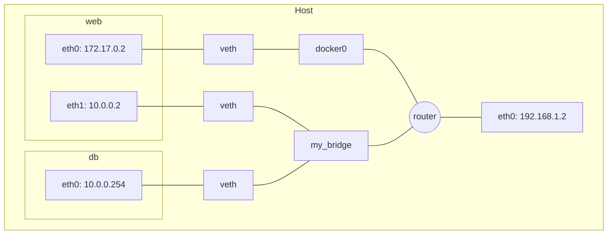

# Docker Networking

Networking allows containers to communicate with each other and with the host system.
Containers run isolated from the host, so they need a way to exchange traffic.

By default, Docker provides network drivers such as bridge and overlay.

## List Docker Networks

```bash
docker network ls
```

Example output:

```text
NETWORK ID          NAME                DRIVER
xxxxxxxxxxxx        none                null
xxxxxxxxxxxx        host                host
xxxxxxxxxxxx        bridge              bridge
```

## Bridge Networking

Bridge is the default network mode in Docker. It creates a private network between host and containers, allowing containers on the same bridge to communicate.



If you want better isolation from the default bridge, create your own bridge network.

```bash
docker network create -d bridge my_bridge
```

Now list the networks again:

```bash
docker network ls
```

Example output:

```text
NETWORK ID          NAME                DRIVER
xxxxxxxxxxxx        bridge              bridge
xxxxxxxxxxxx        my_bridge           bridge
xxxxxxxxxxxx        none                null
xxxxxxxxxxxx        host                host
```

Attach a container to the custom network at startup:

```bash
docker run -d --net=my_bridge --name db training/postgres
```

You can run multiple containers on a single host where one container is on the default bridge and another is on my_bridge.
These containers are isolated and cannot talk to each other directly.



At any time, attach the first container to my_bridge and enable communication between both containers on my_bridge:

```bash
docker network connect my_bridge web
```



## Host Networking

Host mode lets a container share the host network stack directly.
The container uses the host network namespace, IP address, and network configuration.

Run a container with host networking:

```bash
docker run --network="host" <image_name> <command>
```

Notes:

- This reduces isolation from the host and can increase security risk.
- Some image and command combinations may not work with host mode.
- Test with bridge mode first if compatibility is uncertain.

## Overlay Networking

Overlay networking enables communication between containers across multiple Docker hosts.
It allows containers on different hosts to join a single logical network.

## Macvlan Networking

Macvlan mode allows a container to appear as a physical device on the network.
The container gets its own MAC address and can be treated like a separate host.
